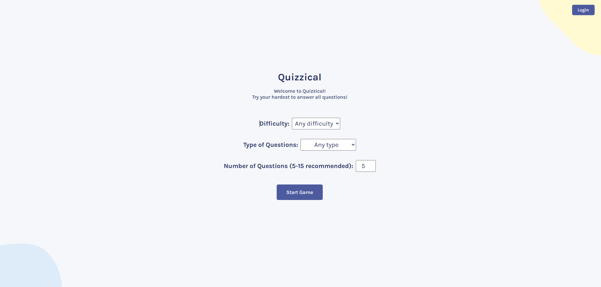
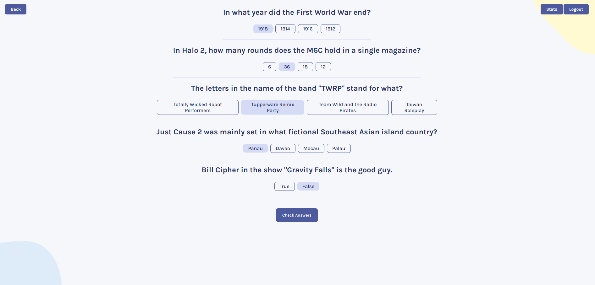
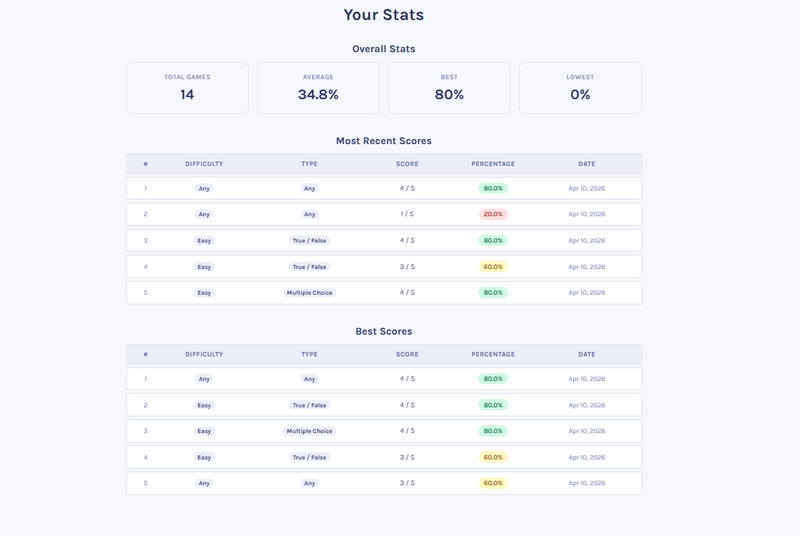

# 🧠 Quizzical

A full-stack trivia application that generates real-time quizzes using the Open Trivia Database API and tracks user performance with a custom backend.

## 🚀 Live Demo

🔗 Frontend: https://quizzical-manrojgill.vercel.app/  
🔗 Backend: https://quizzical-lwpu.onrender.com  

⚠️ Backend is hosted on Render (free tier) → initial requests may take ~30 seconds to load
## 📸 Screenshots

### Start Page

### Quiz In Progress

### Stats Dashboard

---

---

## 📌 Overview

Quizzical is a full-stack application built with React and a Node.js/Express backend. Users can generate quizzes with custom settings, answer interactive questions, and track their performance through a persistent stats system.

---

## ✨ Key Features

### Quiz Functionality
- Configurable number of questions (5–15)
- Selectable difficulty and question type
- Dynamic API requests using Open Trivia DB
- Randomized answer placement
- Real-time answer validation
- Score calculation and feedback
- Restartable quiz sessions

### User & Stats System
- User authentication (JWT-based)
- Score persistence in database
- Personalized stats:
  - Top scores
  - Recent attempts

---

## 🛠 Tech Stack

### Frontend
- React (Vite)
- JavaScript (ES6+)
- Axios
- React Toastify

### Backend
- Node.js
- Express.js
- MongoDB (Mongoose)
- JWT
- bcrypt

---

## 🌐 Data Source

Open Trivia Database API  
https://opentdb.com/

- Dynamic query parameters:
  - amount
  - difficulty
  - type
- Handles empty responses and API edge cases
- Uses `he` to decode HTML entities

---

## 📡 API Routes

### Auth
POST /api/user/register  
POST /api/user/login  

### Scores (requires token)
POST /api/score/add  
GET  /api/score/recent  
GET  /api/score/best  

---

## 🗄️ Score Data

Each score includes:

- userId
- correctAnswers
- totalQuestions
- percentage
- category
- typeOfQuestions

---

## ⚠️ Notes

- Scores are tied to authenticated users
- Percentage is calculated before saving
- Quiz generation depends on external API availability